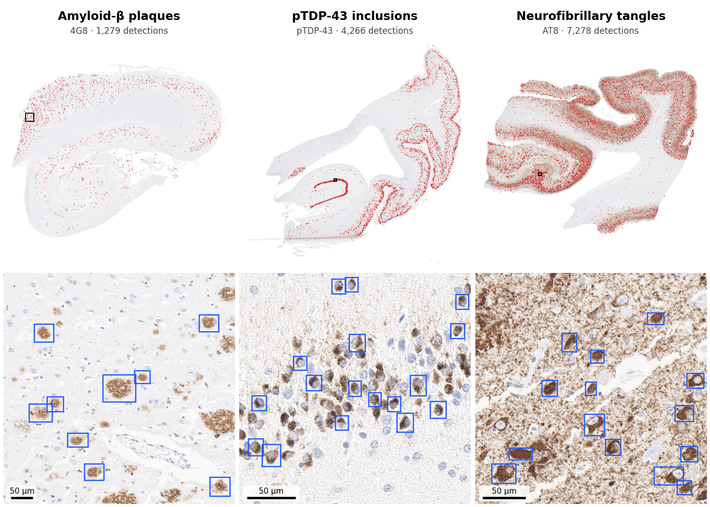

# NeuroSpot-YOLO

Object detectors for neuropathological lesions in immunohistochemistry whole-slide images.
Each model takes a slide (`.svs`, `.tif`, `.ndpi` and other OpenSlide formats) and returns the
location and confidence of every detected lesion, together with its density per mm² of tissue.

Developed by the Center for Computational Neuropathology, Icahn School of Medicine at Mount Sinai.



*Hippocampal sections not used for training or model selection. Top: all detections on the
section (confidence ≥ 0.25). Bottom: the boxed region at full resolution, showing detections
with confidence ≥ 0.5.*

## Models

| Model | Target | Stain | Architecture | Held-out performance | Status |
|---|---|---|---|---|---|
| [`amyloid_plaque`](amyloid_plaque/) | Amyloid-β plaques | 4G8 | YOLO11x | mAP50 0.85, precision 0.91, recall 0.74 ¹ | Released |
| [`ptdp43_inclusion`](ptdp43_inclusion/) | pTDP-43 neuronal cytoplasmic inclusions | pTDP-43 | YOLO11l | AP50 0.84, precision 0.75, recall 0.80 ² | Released |
| [`tau_tangle`](tau_tangle/) | Neurofibrillary tangles | AT8 | YOLO11x | mAP50 0.88, precision 0.85, recall 0.83 ³ | Released |
| [`lewy_body`](lewy_body/) | Lewy bodies | α-synuclein | YOLO11x | mAP50 0.23, precision 0.37, recall 0.33 ³ | Experimental |

¹ Held-out slides; the validation patients also contributed other slides to training.
² Leave-one-patient-out cross-validation over 5 patients, scored in pathologist-reviewed regions.
³ Patients held out entirely from training.

Performance figures are from annotated tiles. Accuracy on whole slides is lower, and each model
has known failure modes. Read the model's own README before using it.

The Lewy body model is included for testing only. It detects roughly a third of annotated Lewy
bodies in held-out cases and is not suitable for quantitative work.

## Installation

Model weights are stored with [Git LFS](https://git-lfs.com), so install it before cloning:

```bash
git lfs install
git clone https://github.com/Center-for-ComputationalNeuropathology/NeuroSpot-YOLO.git
cd NeuroSpot-YOLO
pip install -r tau_tangle/requirements.txt   # or the requirements file of the model you use
```

Each model lists the package versions it was tested with (Python ≥ 3.8, PyTorch, Ultralytics,
OpenSlide); the pTDP-43 model was built with an older Ultralytics release than the others, so
use a separate environment if you run it alongside them. The OpenSlide C library must also be installed, for example
`apt install openslide-tools` or `conda install -c conda-forge openslide`. A CUDA GPU is
recommended; the scripts run on CPU but are slow on whole slides.

If the `.pt` files in `weights/` are only a few hundred bytes, Git LFS was not active when you
cloned; run `git lfs pull` in the repository.

## Usage

Every model has the same command-line interface:

```bash
cd tau_tangle
python infer_wsi.py --slides /path/to/slides/ --out results/ --dsa
python make_heatmap.py --slide /path/to/slide.svs \
    --detections results/<slide>_detections.csv --out results/<slide>_heatmap.png
```

`--slides` accepts files, glob patterns or folders. For each slide, `infer_wsi.py` writes:

| Output | Contents |
|---|---|
| `<slide>_detections.csv` | one row per detection: `x1, y1, x2, y2` in level-0 pixels, and confidence |
| `<slide>_dsa.json` | the same boxes as a Digital Slide Archive / HistomicsTK annotation (with `--dsa`) |
| `summary.tsv` | one row per slide: tissue area (mm²), number of detections, detections per mm² |

Common options are `--conf` (confidence threshold, default 0.25), `--mpp` (override the slide
resolution if the metadata is missing) and `--batch` / `--device` for GPU memory and device
selection.

Slides are tiled at the physical scale each model was trained on, using the resolution stored
in the slide, so scans at other magnifications are rescaled to match. All validation so far is on
40× scans. Tiles overlap, and an object on a tile boundary is
reported once: boxes from neighbouring tiles that overlap (IoU > 0.3), or a cut-off box lying
mostly inside a complete one, are merged, keeping the complete box. Detection densities are only comparable between
slides processed with the same model and settings.

## Repository layout

```
<model>/
  README.md          model card: training data, validation, limitations
  infer_wsi.py       whole-slide inference
  make_heatmap.py    detection and density plot for one slide
  requirements.txt
  weights/           trained weights (Git LFS) and SHA256SUMS
  training/          scripts, configuration and data splits used for training
  examples/          output on a slide not used for training
docs/                figures for this README
```

Training scripts are included so the models can be retrained. The whole-slide images and
annotations used for training are not distributed with this repository.

## Data

Training and validation slides come from the BU ART-AD / NACC collection and other brain bank
cohorts, scanned at 40× (≈0.26 µm/px) unless stated otherwise in the model card. Each model card
lists the patients used for training so that results can be reported on independent cases.

## Contact

Please use GitHub issues for questions and bug reports.
