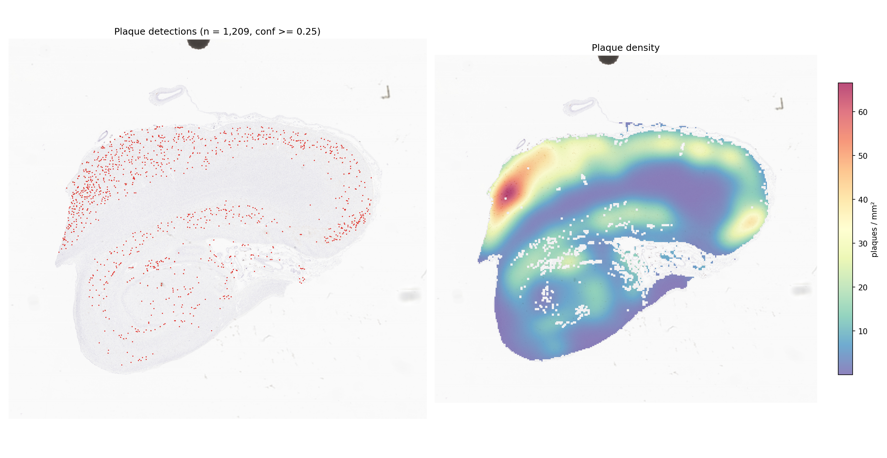

# NeuroSpot-YOLO: amyloid-β plaque detector

A YOLO11x object detector for amyloid-β plaques in anti-Aβ (4G8) immunohistochemistry
whole-slide images (WSI). Given a slide it returns every plaque as a bounding box with a
confidence score, plus the plaque density per mm² of tissue.



*Hippocampus section NACC158151 (AB4G8), not used for training: 1,209 plaques, 13.6 / mm² at conf ≥ 0.25.*

## Quick start

```bash
# 1. environment (Python 3.9+; OpenSlide C library required)
pip install -r requirements.txt

# 2. weights (114 MB, stored via Git LFS -- see "Weights" section below if `git clone`
#    didn't already fetch it, e.g. because git-lfs wasn't installed at clone time)
git lfs pull

# 3. run on one slide, a list, a glob or a folder
python infer_wsi.py --slides /path/to/slides/ --out results/ --dsa

# 4. (optional) detection + density figure for a slide
python make_heatmap.py --slide /path/to/slide.svs \
    --detections results/<slide>_detections.csv --out results/<slide>_heatmap.png
```

A GPU is used automatically if available (`--device cpu` to force CPU). A 65,000 × 59,000 px
hippocampus section takes ~3 min on one V100.

### Outputs

| File | Content |
|---|---|
| `<slide>_detections.csv` | one row per plaque: `x1,y1,x2,y2` (level-0 pixels), `conf` |
| `<slide>_dsa.json` | same boxes as a DSA / HistomicsTK annotation (with `--dsa`) |
| `summary.tsv` | one row per slide: size, µm/px, tile size, tissue area (mm²), number of plaques, plaques / mm² |

Options: `--conf` (default 0.25), `--mpp` (override slide resolution if the metadata is missing
or wrong), `--batch`, `--device`.

## How a slide is processed

These choices mirror how the training data was made; changing them changes the results.

1. **Physical scale.** Training tiles were 1024 px at ~0.263 µm/px (40×), i.e. ~269 µm per side,
   resized to 640 px for the network. The slide is cut into ~269 µm tiles *at whatever its own
   resolution is* (read from `openslide.mpp-x`), so plaques always appear at the trained size.
   Slides without resolution metadata are assumed to be 40× (a warning is printed; use `--mpp`).
2. **Tissue.** A tissue mask from the slide thumbnail selects which tiles to read; near-blank
   tiles are skipped. Density is reported per mm² of this tissue mask.
3. **Overlap and de-duplication.** Tiles overlap by 25 % so a plaque on one tile's edge is whole
   in its neighbour; boxes of the same plaque from neighbouring tiles are merged in slide
   coordinates (IoU > 0.3, or a box cut off by a tile edge lying ≥ 50 % inside a complete box; complete boxes are kept over cut-off ones). Without this, plaques near tile
   edges are counted twice.
4. **Threshold.** Boxes with confidence ≥ 0.25 are kept.

## Model

| | |
|---|---|
| Architecture | YOLO11x (Ultralytics 8.4.46), fine-tuned from COCO weights |
| Class | 1: `Amyloid_Plaque` (diffuse, cored and compact plaques merged) |
| Input | 640 × 640 (1024 px tiles at 40×, resized) |
| Training data | 16 NACC slides / 7 cases, AB4G8 (brown DAB), 551 tiles |
| Validation data | 3 NACC slides, 72 tiles, 115 annotated plaques |
| Training | 150 epochs max (early stop, patience 30; best epoch kept), batch 16, SGD auto, seed 0 |
| Augmentation | flips (both axes), rotation ±180°, scale 0.3, translate 0.1, HSV (h 0.10, s 0.7, v 0.4), mosaic (off for last 15 epochs) |

Validation performance (`model.val`, conf 0.001, IoU 0.6):

| Precision | Recall | mAP50 | mAP50-95 |
|---|---|---|---|
| 0.909 | 0.739 | 0.852 | 0.365 |

Full training curves and settings: [`training/run_amyloid_plaque_nacc_only/`](training/run_amyloid_plaque_nacc_only/).

### Limitations — please read before using

- **Validation is not patient-independent.** The 3 validation slides come from 2 cases
  (NACC004234, NACC018551) that also have other slides in the training set
  ([`training/nacc_only_split.tsv`](training/nacc_only_split.tsv)). The numbers above are
  therefore likely optimistic for new patients. When reporting results, test on slides from
  cases not listed in that file.
- **Stain.** Trained on brown-DAB 4G8 staining at 40×. Other antibodies, chromogens (e.g. red
  Fast-Red), scanners or magnifications have not been validated.
- **Not specific to amyloid on other stains.** Run on non-Aβ stains of the same hippocampal
  block, the model still fires on other brown-stained structures — heavily on AT8 (p-tau)
  (~89 detections / mm², vs 13 / mm² on the Aβ section of the same case) and weakly on pTDP-43
  and α-synuclein (1–3 / mm²). Only apply it to Aβ-stained slides.
- **Counts are model detections, not pathologist counts.** Annotations used for training were
  not exhaustive over whole slides (ROI-based), and faint diffuse deposits are the most
  commonly missed. Treat plaques / mm² as a relative burden measure across slides processed
  the same way.

## Reproducing training

```bash
cd training
# tiles from the DSA/HistomicsTK annotation exports listed in a manifest
#   (TSV with columns Image_path, Json_path; see the docstring of build_dataset.py)
python build_dataset.py --manifest amyloid-beta_manifest.tsv --out dataset
python make_nacc_only_subset.py --src dataset --out dataset_nacc_only
python train.py --data dataset_nacc_only/data.yaml --model yolo11x.pt --imgsz 640 \
    --epochs 150 --batch 16 --name amyloid_plaque_nacc_only
```

The slide-level split used for the released weights is in
[`training/nacc_only_split.tsv`](training/nacc_only_split.tsv) (the split is made by
`build_dataset.py` with seed 42). The whole-slide images and annotations are not included in
this repository.

## Weights

The trained model (`weights/amyloid_plaque_yolo11x.pt`, 114 MB) is stored directly in this repo
via **Git LFS** (GitHub blocks plain git files over 100 MB, so it's tracked as an LFS object
instead — see `.gitattributes`). `infer_wsi.py` looks for it at exactly that path by default, so
nothing extra to configure once it's downloaded.

**If you already have `git-lfs` installed**, `git clone` fetches the real weights file
automatically — nothing else to do. Check with:
```bash
git lfs ls-files    # should list amyloid_plaque/weights/amyloid_plaque_yolo11x.pt
```

**If you don't have `git-lfs` yet** (`git clone` will leave a small text pointer file instead of
the real weights in that case):
```bash
# install once (macOS: brew install git-lfs; Ubuntu/Debian: apt install git-lfs;
# conda: conda install -c conda-forge git-lfs; HPC module systems: module load git-lfs)
git lfs install
git lfs pull        # fetches the real file into weights/amyloid_plaque_yolo11x.pt
```

**Verify it downloaded correctly:**
```bash
cd amyloid_plaque/weights && sha256sum -c SHA256SUMS
```
It should print `amyloid_plaque_yolo11x.pt: OK`. If it prints `FAILED`, or the file is only a few
hundred bytes of text starting with `version https://git-lfs.github.com/...`, `git-lfs` wasn't
installed when you cloned — install it and run `git lfs pull` as above.

SHA-256: `681c2117a37e3c6043494da2459d7c4570c6f9942e5944d11aa6e9834b1f1840`
