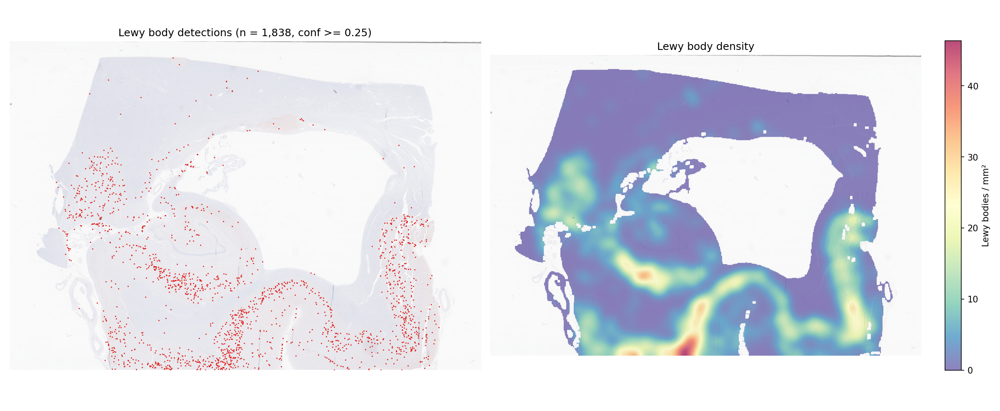
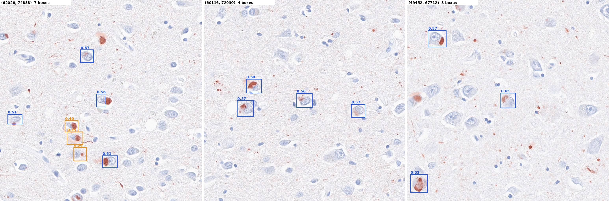

# NeuroSpot-YOLO: Lewy body detector — EXPERIMENTAL

> **This is a test release, not a validated model.** On held-out patients it finds about one
> in three annotated Lewy bodies, and only about a third of its detections are correct. Use it
> to explore the data or as a starting point for further training, not for quantitative
> analysis. The other NeuroSpot models perform far better (held-out mAP50 0.83–0.88 vs 0.23
> here).

A YOLO11x object detector for Lewy bodies in α-synuclein immunohistochemistry whole-slide images
(WSI). Given a slide it returns every candidate Lewy body as a bounding box with a confidence
score, plus the density per mm² of tissue. Same interface as the other NeuroSpot models.



*Hippocampus section NACC378947_14 (α-synuclein), not used for training: 1,838 detections,
4.4 / mm² at conf ≥ 0.25 (~19 min on one V100).*



*Three of the densest fields (each ~270 µm; blue ≥ 0.5, orange 0.25–0.5). Most boxes are on
neuronal cytoplasmic inclusions, but some clear inclusions are missed (e.g. upper left of the
first field) and several low-confidence boxes are on faint staining.*

## Quick start

```bash
# 1. environment (Python 3.8+; OpenSlide C library required)
pip install -r requirements.txt

# 2. weights (114 MB, stored via Git LFS)
git lfs pull

# 3. run on one slide, a list, a glob or a folder
python infer_wsi.py --slides /path/to/slides/ --out results/ --dsa

# 4. (optional) detection + density figure for a slide
python make_heatmap.py --slide /path/to/slide.svs \
    --detections results/<slide>_detections.csv --out results/<slide>_heatmap.png
```

### Outputs

| File | Content |
|---|---|
| `<slide>_detections.csv` | one row per detection: `x1,y1,x2,y2` (level-0 pixels), `conf` |
| `<slide>_dsa.json` | same boxes as a DSA / HistomicsTK annotation (with `--dsa`) |
| `summary.tsv` | one row per slide: size, µm/px, tile size, tissue area (mm²), number of detections, detections / mm² |

Options: `--conf` (default 0.25), `--mpp`, `--batch`, `--device`.

## How a slide is processed

1. **Physical scale.** Training tiles were 640 px at ~0.263 µm/px (40×), ~168 µm per side, fed to
   the network at 640 px. Slides are cut into ~168 µm tiles at their own resolution.
2. **Tissue.** A tissue mask from the slide thumbnail selects which tiles to read; density is
   per mm² of that mask.
3. **Overlap and de-duplication.** Tiles overlap by 25 %; boxes of the same object from
   neighbouring tiles are merged (greedy, IoU > 0.3, keep the most confident).
4. **Threshold.** Boxes with confidence ≥ 0.25 are kept.

## Model

| | |
|---|---|
| Architecture | YOLO11x (Ultralytics), fine-tuned from COCO weights |
| Class | 1: `lewy_body` |
| Input | 640 px tiles at 40×, imgsz 640 |
| Data | 14 α-synuclein slides from 8 cases (NACC and NPBB); ~1,600 annotated Lewy bodies |
| Split | case-level: 6 cases train (12 slides, 4,140 tiles), 2 cases held out (NACC075420, NPBB51; 1,070 tiles) |
| Training | 150 epochs max (early stop), batch 16, yolo11x base; best epoch 17 |

### Validation — held-out cases

| Precision | Recall | mAP50 | mAP50-95 |
|---|---|---|---|
| 0.369 | 0.332 | 0.228 | 0.087 |

Training curves and settings: [`training/run_lewy_body_v2/`](training/run_lewy_body_v2/).

### Why it is experimental

- **Low accuracy on held-out cases** (table above). Every training variant tried — different
  data subsets, augmentation, a 10× lower learning rate, fine-tuning an older lab model — peaked
  early (epoch 5–40) at mAP50 ≤ 0.25 and then declined, so the limit appears to be the data
  rather than the training settings.
- **Few cases.** 6 training cases; Lewy bodies are small and sparse, and the annotations come
  from several annotators and protocols.
- **Other α-synuclein pathology.** Lewy neurites, glial inclusions and dense neuritic staining
  look similar at this scale and are likely sources of false positives; the model has one class
  and does not distinguish them.
- **Not specific to α-synuclein slides.** A sibling model trained on the same data with a lower
  learning rate still fired on other stains (~2.7 detections / mm² on an Aβ-stained hippocampus
  section). Only use it on α-synuclein-stained slides.

## Reproducing training

```bash
cd training
LEWY_MANIFEST=lewy_body_manifest.tsv python 01_select_annotations.py   # DSA annotations -> per-slide boxes
python 06_tile_full_v2.py                                               # 640 px tiles, case-level split
LEWY_ROOT=. python 07_train_full_v2.py
```

The slides and annotations are not included in this repository.

## Weights

`weights/lewy_body_yolo11x.pt` — SHA-256 `570d71920566f959c2369cfd3bfddbe936d46ee943f0fefe6fc7ff517dd75817`.
