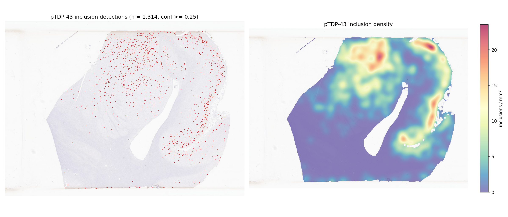

# NeuroSpot-YOLO: pTDP-43 inclusion detector

A YOLO11l object detector for phosphorylated TDP-43 (pTDP-43) neuronal cytoplasmic inclusions
in anti-pTDP-43 immunohistochemistry whole-slide images (WSI). Given a slide it returns every
inclusion as a bounding box with a confidence score, plus the inclusion density per mm² of tissue.



*Section NACC003627_11 (pTDP-43), not used for training or model selection: 1,314 inclusions,
3.5 / mm² at conf ≥ 0.25.*

## Quick start

```bash
# 1. environment (Python 3.8+; OpenSlide C library required)
pip install -r requirements.txt

# 2. weights (51 MB, stored via Git LFS -- see "Weights" below if `git clone`
#    didn't already fetch it, e.g. because git-lfs wasn't installed at clone time)
git lfs pull

# 3. run on one slide, a list, a glob or a folder
python infer_wsi.py --slides /path/to/slides/ --out results/ --dsa

# 4. (optional) detection + density figure for a slide
python make_heatmap.py --slide /path/to/slide.svs \
    --detections results/<slide>_detections.csv --out results/<slide>_heatmap.png
```

A GPU is used automatically if available (`--device cpu` to force CPU). The network input is
1536 px, so memory per tile is ~6× the amyloid model's: `--batch 8` (default) fits a 40–80 GB GPU;
use `--batch 2` or `4` on a 16 GB card. A 117,000 × 86,000 px section takes ~20 min (tile reading is the bottleneck; peak RAM 1.6 GB) on one H100.

### Outputs

| File | Content |
|---|---|
| `<slide>_detections.csv` | one row per inclusion: `x1,y1,x2,y2` (level-0 pixels), `conf` |
| `<slide>_dsa.json` | same boxes as a DSA / HistomicsTK annotation (with `--dsa`) |
| `summary.tsv` | one row per slide: size, µm/px, tile size, tissue area (mm²), number of inclusions, inclusions / mm² |

Options: `--conf` (default 0.25), `--mpp` (override slide resolution if the metadata is missing
or wrong), `--batch`, `--device`.

## How a slide is processed

These choices mirror how the training data was made; changing them changes the results.

1. **Physical scale.** The model was trained on 640 px windows at ~0.263 µm/px (40×), fed to the
   network at 960 px (a 1.5× upscale — inclusions are only ~15–20 µm). Slides are read in
   ~269 µm tiles (1024 px at 40×) and fed at 1536 px, the same 1.5× pixel scale; on held-out
   annotated regions this gives AP50 0.844 vs 0.829 at the training setting. For a slide at
   another resolution the window is resized so it still covers ~269 µm. Slides without resolution
   metadata are assumed to be 40× (a warning is printed; use `--mpp`).
2. **Tissue.** A tissue mask from the slide thumbnail selects which tiles to read; near-blank tiles
   are skipped. Density is reported per mm² of this tissue mask.
3. **Overlap and de-duplication.** Tiles overlap by 25 %; boxes of the same inclusion from
   neighbouring tiles are merged in slide coordinates (IoU > 0.3, or a box cut off by a tile edge lying ≥ 50 % inside a complete box; complete boxes are kept over cut-off ones).
4. **Threshold.** Boxes with confidence ≥ 0.25 are kept (the best-F1 point in cross-validation
   was 0.24). Confidences are moderate overall; see Limitations before raising or lowering it.

## Model

| | |
|---|---|
| Architecture | YOLO11l (Ultralytics 8.3.40), fine-tuned from COCO weights |
| Class | 1: `pTDP43_Inclusion` (compact, ring, flame/lentiform and "ghost"/faint inclusions merged) |
| Input | 640 px windows at 40×, trained at imgsz 960 |
| Annotated data | 6 NACC slides / **5 patients** (BU ART-AD, pTDP-43 DAB, 40×), 803 annotated inclusions inside pathologist-reviewed ROIs, plus BOP whole-slide annotations (train only) |
| Hard-negative mining | 2 rounds on 25 unannotated cohort slides, human-reviewed (see below) |
| Final training | all 5 patients, 937 tiles: 66 epochs (= median best epoch in CV), batch 4, SGD auto, seed 0 |
| Augmentation | horizontal flip, rotation ±10°, scale 0.5, translate 0.15, HSV (h 0.03, s 0.9, v 0.6), mosaic (off for last 10 epochs), mixup 0.15 — see [`training/augmentation_examples.png`](training/augmentation_examples.png) |

### Validation — patient-level (leave-one-patient-out)

With only 5 annotated patients a single split is too noisy, so each patient was held out in turn
(both slides of NACC036233 together), and scored only inside its pathologist-reviewed ROIs (the
only exhaustively annotated regions). Released model (`hn2`), IoU 0.5:

| Held-out patient | Inclusions | AP50 | Precision | Recall |
|---|---|---|---|---|
| NACC036233 | 133 | 0.882 | 0.819 | 0.850 |
| NACC054803 | 65 | 0.851 | 0.760 | 0.877 |
| NACC068046 | 225 | 0.815 | 0.759 | 0.716 |
| NACC782796 | 171 | 0.888 | 0.819 | 0.848 |
| NACC928383 | 209 | 0.820 | 0.664 | 0.842 |
| **Pooled** | **803** | **0.835** | **0.750** | **0.796** |

All model versions (including a baseline trained with 3 additional non-NACC cases, which was
not better) are in [`training/cv_results.tsv`](training/cv_results.tsv).

### Whole-slide behaviour and the hard-negative rounds

ROI accuracy does not transfer to whole slides. The first model (v1, ROI AP50 0.829) was blindly
reviewed on 10 unseen cohort slides: only **16 %** of its detections at conf ≥ 0.25 were real
inclusions — whole slides contain hair, folds, stained tissue edges, pale granular precipitate and
debris that never appear inside annotated ROIs. Two rounds of human review on 25 other cohort
slides fixed this:

| Version | Added to training | Detections ≥ 0.25 on 10 held-out slides | Whole-slide precision |
|---|---|---|---|
| v1 | — | 10,817 | 16 % (blind review) |
| hn1 | 260 negatives (gross artifacts + subtle look-alikes) | 521 | 52 %, but missed ~50 % of real inclusions |
| **hn2 (released)** | 148 gross-artifact negatives + 85 windows around 50 reviewed real inclusions | 2,719 | **not formally measured** (~65 % on visual review of one slide) |

Review labels and scores: [`training/hard_negatives/`](training/hard_negatives/).

### Limitations — please read before using

- **Whole-slide precision of the released model is not measured.** On visual review roughly
  two-thirds of detections are real. Remaining false positives are mostly *subtle*: faint or
  diffuse cytoplasmic staining, neurite fragments, and on some slides a band along the stained
  tissue edge. Treat inclusions / mm² as a **relative** burden measure for ranking and association
  across slides processed the same way, not as an absolute pathologist count; check that
  conclusions also hold at `--conf 0.35` / `0.5`.
- **Small training set.** 5 patients from one brain bank, one antibody, one scanner (40×,
  0.263 µm/px). Other antibodies, chromogens, scanners or magnifications have not been validated.
- **Development slides.** The 5 training patients are in [`training/nacc_split.tsv`](training/nacc_split.tsv);
  the 25 mining slides and 10 evaluation slides used during development are in
  [`training/hard_negatives/development_slides.tsv`](training/hard_negatives/development_slides.tsv).
  Exclude the training patients when reporting results.
- **pTDP-43 slides only.** Like any IHC detector it keys on brown DAB structures of the right size;
  do not apply it to other stains.
- **Numbers depend on the tiling.** Our NACC cohort tables were produced from pre-extracted
  non-overlapping 1024 px tiles; `infer_wsi.py` uses 25 % overlap, de-duplication and its own
  tissue mask, so per-slide values differ slightly (on the example slide: 1,314 inclusions / 3.5 per mm² here vs 1,595 / 4.0 per mm² in the cohort table).

## Reproducing training

The scripts in [`training/`](training/) are the ones used, with our cluster paths at the top of
each file (edit `REPO_ROOT` / `BASE` / slide-list paths). Order:

```bash
python STEP1_resolve_annotations.py      # DSA/HistomicsTK JSONs in pTDP43_manifest_nacc.tsv -> resolved boxes/ROIs
python STEP3_build_nacc_cv.py            # 640 px ROI tiles + BOP positives + DAB-checked negatives, 5 LOCO folds + all/
python STEP2d_build_hardneg_dataset.py   # round-1 review labels -> hn1 dataset (not released; kept for reproducibility)
python STEP2e_build_hn2_dataset.py       # artifact negatives + reviewed positives -> hn2 dataset (released model)
TDP43_DATASET=dataset_nacc_cv_hn2 python STEP4_train_nacc_cv.py <NACCID>     # one CV fold
TDP43_DATASET=dataset_nacc_cv_hn2 python STEP4_train_nacc_final.py           # final model, 66 epochs, no val
python STEP5_eval_nacc_cv.py             # pooled patient-level evaluation
```

Key dataset rules (details in each script's docstring): tiles only from inside reviewed ROIs;
`ROI_TEST` regions excluded everywhere (they contain unannotated inclusions); background outside
ROIs only if a calibrated DAB-blob test finds no stain; split by patient, never by slide. The
whole-slide images and annotations are not included in this repository.
`training/run_ptdp43_final/` holds the final run's settings, loss curves and augmented training
batches (it had no validation split, so no validation plots are included).

## Weights

The trained model (`weights/ptdp43_inclusion_yolo11l.pt`, 51 MB) is stored via **Git LFS**
(see `.gitattributes`). `infer_wsi.py` looks for it at exactly that path by default.

**If you already have `git-lfs` installed**, `git clone` fetches the real weights file automatically:
```bash
git lfs ls-files    # should list ptdp43_inclusion/weights/ptdp43_inclusion_yolo11l.pt
```

**If you don't have `git-lfs` yet** (`git clone` leaves a small text pointer file instead):
```bash
# install once (macOS: brew install git-lfs; Ubuntu/Debian: apt install git-lfs;
# conda: conda install -c conda-forge git-lfs; HPC module systems: module load git-lfs)
git lfs install
git lfs pull
```

**Verify it downloaded correctly:**
```bash
cd ptdp43_inclusion/weights && sha256sum -c SHA256SUMS
```
It should print `ptdp43_inclusion_yolo11l.pt: OK`.

SHA-256: `c75f1eae6cac1e79538f4b9dd7bd159a267258d56952da383ea05dcfbeaa162f`
