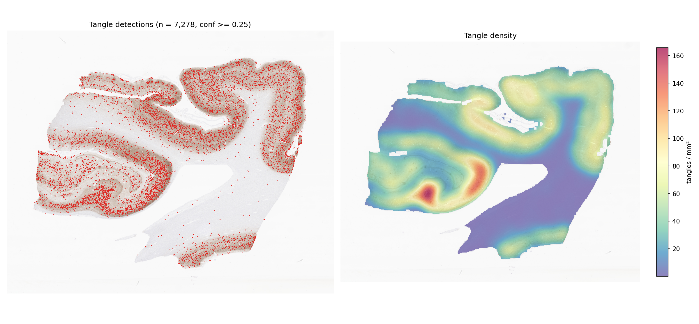
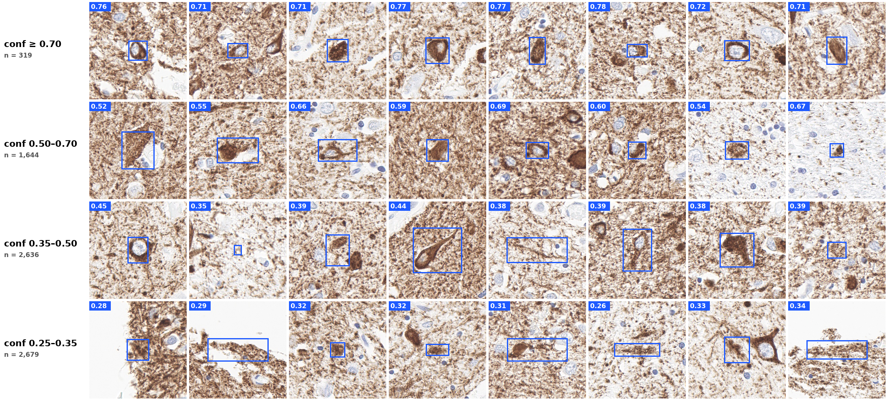

# NeuroSpot-YOLO: neurofibrillary tangle detector

A YOLO11x object detector for neurofibrillary tangles (NFTs) in AT8 (phospho-tau)
immunohistochemistry whole-slide images (WSI). Given a slide it returns every tangle as a
bounding box with a confidence score, plus the tangle density per mm² of tissue.

> **Read the [limitations](#limitations--please-read-before-using) before using this model.**
> It was trained on non-NACC tiles from two collections scanned at different magnifications,
> and the training annotations have known inconsistencies.



*Hippocampus section NACC603622_14 (AT8), not used for training: 7,278 tangles, 38.3 / mm² at
conf ≥ 0.25 (1,963 at ≥ 0.5).*



*Random detections from the same section in each confidence band (model box in blue, score top left;
n = number of detections in that band).*

## Quick start

```bash
# 1. environment (Python 3.8+; OpenSlide C library required)
pip install -r requirements.txt

# 2. weights (114 MB, stored via Git LFS)
git lfs pull

# 3. run on one slide, a list, a glob or a folder
python infer_wsi.py --slides /path/to/slides/ --out results/ --dsa

# 4. (optional) detection + density figure for a slide
python make_heatmap.py --slide /path/to/slide.svs \
    --detections results/<slide>_detections.csv --out results/<slide>_heatmap.png
```

A GPU is used automatically if available (`--device cpu` to force CPU). Tiles are small (67 µm)
and overlap by 50 %, so a whole section needs many tiles: ~85,000–170,000 for a hippocampus
section, which took 37–74 min on one V100 (16 GB, `--batch 64`) — much slower than the other
NeuroSpot models. The time is mostly the network itself (YOLO11x on every tile).

### Outputs

| File | Content |
|---|---|
| `<slide>_detections.csv` | one row per tangle: `x1,y1,x2,y2` (level-0 pixels), `conf` |
| `<slide>_dsa.json` | same boxes as a DSA / HistomicsTK annotation (with `--dsa`) |
| `summary.tsv` | one row per slide: size, µm/px, tile size, tissue area (mm²), number of tangles, tangles / mm² |

Options: `--scale` (`40x` default, or `20x`; see below), `--conf` (default 0.25), `--mpp`
(override slide resolution if the metadata is missing or wrong), `--batch`, `--device`.

## How a slide is processed

1. **Physical scale.** The training tiles are 256 px from two collections at two
   magnifications: BU and MS at 40× (~0.263 µm/px, ~67 µm per tile) and PART at 20×
   (~0.53 µm/px, ~135 µm per tile), all resized to 640 px for the network. `--scale` chooses
   which to reproduce; the crop window is set in micrometres from the slide's own resolution
   (`openslide.mpp-x`), so it works for slides scanned at 20× or 40×. **40× is the default**:
   on held-out patients it gives tighter boxes and higher precision (table below), and it is
   ~2/3 of the training data.
2. **Tissue.** A tissue mask from the slide thumbnail selects which tiles to read; near-blank
   tiles are skipped. Density is reported per mm² of this tissue mask.
3. **Overlap and de-duplication.** Tiles overlap by 50 % so any tangle up to half a tile across
   (~34 µm at 40×) is whole in at least one tile; boxes of the same tangle from neighbouring
   tiles are merged in slide coordinates (greedy, IoU > 0.3, keep the most confident).
4. **Threshold.** Boxes with confidence ≥ 0.25 are kept.

## Model

| | |
|---|---|
| Architecture | YOLO11x (Ultralytics), fine-tuned from COCO weights |
| Class | 1: `NFT` |
| Input | 256 px tiles (40× BU/MS, 20× PART), trained at imgsz 640 |
| Data | 18 patients (BU, MS, PART collections; no NACC), 8,443 tiles |
| Split | patient-level: 15 patients train (7,208 tiles), 3 held out (1,235 tiles) — [`training/patient_split.csv`](training/patient_split.csv) |
| Training | 100 epochs max (early stop, patience 15; best epoch 81), batch 16, SGD auto, seed 0 |
| Augmentation | Ultralytics defaults: horizontal flip, scale 0.5, translate 0.1, HSV (h 0.015, s 0.7, v 0.4), mosaic (off for last 10 epochs); no rotation or vertical flip |

### Validation — held-out patients

No train/validation overlap in patients, slides, ROIs, filenames or image hashes
(BU-P12699, PART42025, PART42027 held out). IoU 0.5:

| Held-out tiles | Tiles | Precision | Recall | mAP50 | mAP50-95 |
|---|---|---|---|---|---|
| All 3 patients (best epoch) | 1,235 | 0.845 | 0.828 | 0.876 | 0.427 |
| BU-P12699 (40×) | 950 | 0.893 | 0.841 | 0.879 | 0.482 |
| PART42025 + PART42027 (20×) | 285 | 0.810 | 0.822 | 0.857 | 0.312 |

([`training/val_by_collection.tsv`](training/val_by_collection.tsv); training curves in
[`training/run_tau_tangle_v2/`](training/run_tau_tangle_v2/).) An earlier model trained on a
random tile split scored higher (mAP50 0.93), but 42 of its 43 validation slide groups were
also in training; it is not released.

### Limitations — please read before using

- **Training annotations did not pass QC.** A review of the training data found substantial
  disagreements between tangle masks on pixel-identical tissue in 339 PART tile pairs, i.e. the
  per-tile labels are not exhaustive or consistent. Missed tangles in training labels teach the
  model to ignore some real tangles, which lowers recall on whole slides.
- **Mixed magnification.** The model learned tangles at two pixel scales (40× and 20×). The
  default `--scale 40x` matches the larger and better-performing part of the training data,
  but has not been validated against pathologist counts on whole slides.
- **Not trained on NACC / BU ART-AD slides.** All training patients are from the BU, MS and PART
  collections. Detection completeness varies between NACC sections: on NACC603622 (shown above)
  most dense tangles were boxed, while on NACC158151 obvious tangles were missed. Performance on
  other cohorts, stains or scanners is unvalidated.
- **Small objects at tile edges.** Tangles larger than ~34 µm (e.g. long flame-shaped tangles)
  can be cut by every tile and may be missed or boxed in parts.
- **Sensitive to where a tangle falls in the tile.** With 50 % overlap most tangles are seen in
  up to four tiles, yet on NACC158151 de-duplication merged only 4,310 raw boxes into 3,695
  tangles, i.e. most tangles were detected in only one of the tiles containing them. The
  overlap therefore raises recall substantially, and counts depend on the tiling: only compare
  densities produced by this script with these settings (the same section scanned with
  non-overlapping tiles gave ~1,000 detections).
- **Validation is tile-level, on 3 patients.** Whole-slide precision and recall have not been
  measured. Treat tangles / mm² as a **relative** burden measure across slides processed the
  same way, and check that conclusions hold at higher thresholds (`--conf 0.35` / `0.5`).

## Reproducing training

```bash
cd training
# patient-level split -> YOLO dataset (symlinks the original 256 px tiles and labels)
TANGLES_DIR=/path/to/original/tiles python build_dataset_v2.py \
    --manifest patch_split_manifest.csv --output dataset_v2
python train.py --data dataset_v2/dataset.yaml --model yolo11x.pt
```

[`patch_split_manifest.csv`](training/patch_split_manifest.csv) assigns every tile to train or valid (with its source image hash);
`plan_case_split.py` is the script that chose the held-out patients (exhaustive seed-42 search
balancing tile, positive and background counts). The tiles and annotations themselves are not
included in this repository.

## Weights

`weights/tau_tangle_yolo11x.pt` — SHA-256 `ae19f8b862bfd1c4cbe8522fe8df83fe01956e0041851c8d1bb1bf1793541de9`.
